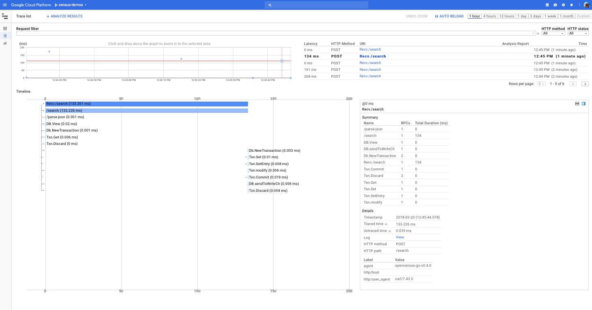
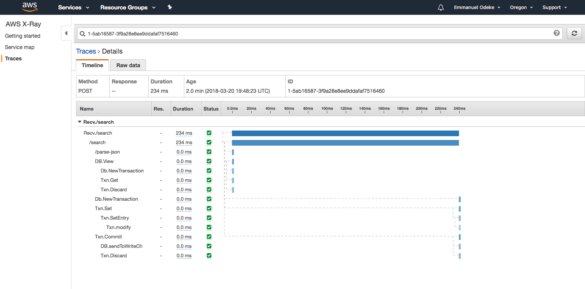
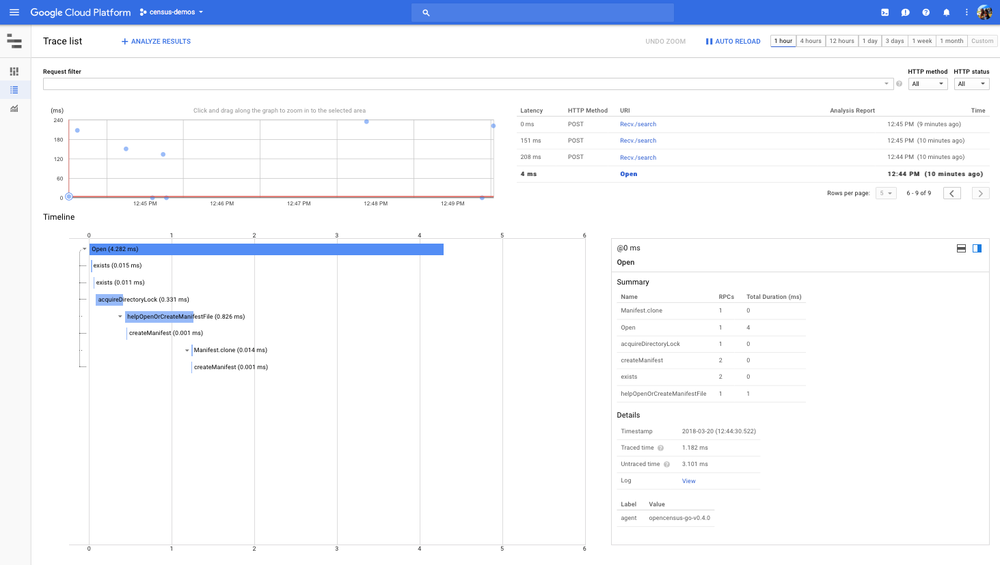
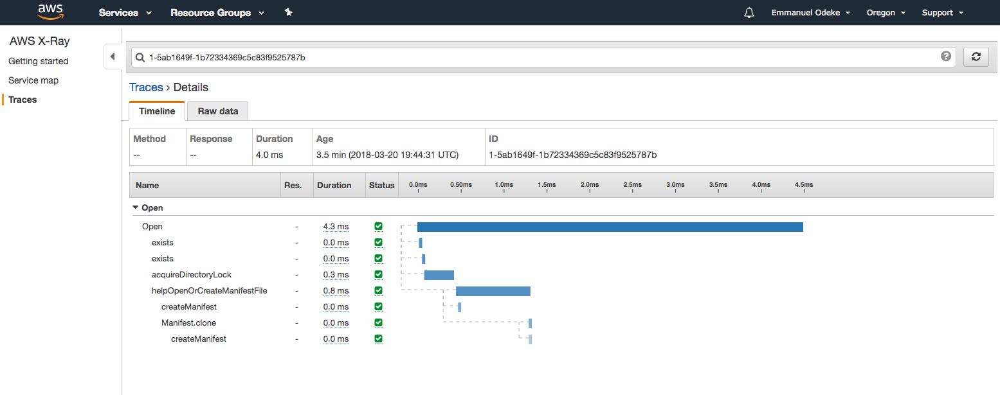

## media-search

An app that uses BadgerDB as the key-value store for lightning speed.
However this version of BadgerDB is instrumented with OpenCensus and
since it has context propagation, clients can send their traces
end to end, receive and export them to their choices of backends.

### Requirements
* Instrumented MongoDB:
Get it at and install it normally https://github.com/orijtech/mongo-go-driver

* Python3 and Go:
The server is in Go, and is accessed by API clients in various languages
such as Python3, Go, Java etc. 

The Python client requires the Python OpenCensus package to be installed.
The Go server requires you to run `go get -u ./media-search`

Giving such:

##### Go server
```shell
$ GOOGLE_APPLICATION_CREDENTIALS=~/Downloads/census-demos-237a8e1e41df.json go run server.go
2018/04/06 10:36:10 Successfully finished exporter and view registration
2018/04/06 10:36:10 Serving on ":9778"
```

##### Go client
```shell
$ GOOGLE_APPLICATION_CREDENTIALS=~/Downloads/census-demos-237a8e1e41df.json go run client.go
Content to search$ Look alive
URL: https://youtu.be/NV-3s2wwC8c
Title: BlocBoy JB & Drake "Look Alive" Prod By: Tay Keith (Official Music Video) Shot By: @Fredrivk_Ali
Description: For Features, Booking, & Etc Email BlocBoyJB@Gmail.com http://ovosound.io/lookalive For More Info On Videos Contact aliproductions2016@gmail.com https://www.instagram.com/fredrivk_ali https://ww...


URL: https://youtu.be/aFYUfzcjuaw
Title: Look Alive (feat. Drake)
Description: Provided to YouTube by Warner Music Group Look Alive (feat. Drake) · BlocBoy JB · Drake Look Alive (feat. Drake) ℗ 2018 OVO Sound/Warner Bros. Records Inc. Lead Vocals: BlocBoy JB...


URL: https://youtu.be/dM1mlgEA5zo
Title: "Look Alive" - @BlocBoy_JB ft. ChampagnePapi | @THEFUTUREKINGZ x AYO & TEO x @_TWEEEZY
Description: 


URL: https://youtu.be/Wd_idMpg_qQ
Title: Joyner Lucas - Look Alive (Remix)
Description: I'm Kind of A Big Deal Tour: http://www.joynerlucas.com/tour/ 508 Project Available on Spotify and iTunes: https://atlantic.lnk.to/508-507-2209 Follow Joyner: @joynerlucas Bookings: http://bit.ly/...


URL: https://youtu.be/rPZtXYaY4do
Title: Rae Sremmurd - Look Alive
Description: Rae Sremmurd “SremmLife 2” available now iTunes: http://smarturl.it/SremmLife2 Apple Music: http://smarturl.it/SremmLife2.AP Google Play: http://smarturl.it/SremmLife2.GP Amazon: http://smart...


Content to search$ 
```

##### Python client
```shell
$ GOOGLE_APPLICATION_CREDENTIALS=~/Downloads/census-demos-237a8e1e41df.json python3 search.py
Content to search$ SQL
URL: https://youtu.be/7Vtl2WggqOg
Title: SQL for Beginners. Learn basics  of SQL in 1 Hour
Description: SQL is a special-purpose programming language designed for managing data in a relational database, and is used by a huge number of apps and organizations. Buy SQL Books from Amazon at http://amzn.t...


URL: https://youtu.be/nWeW3sCmD2k
Title: SQL Crash Course - Beginner to Intermediate
Description: In this course we will cover all of the fundamentals of the SQL (Structured Query Language). This course is great for beginners and also intermediates. We will cover the following... Overview...


URL: https://youtu.be/FR4QIeZaPeM
Title: What is Database & SQL?
Description: https://www.guru99.com/introduction-to-database-sql.html This Database tutorial explains the concept of DBMS (Database Management System), examples of real life DBMS systems and types of...


Title: SQL Server tutorial for beginners
Description: In this tutorial, we will start from the very basics and cover topics like joins, views, triggers, system functions, stored procedures, user defined scalar and table valued functions etc. These...


URL: https://youtu.be/9Pzj7Aj25lw
Title: Learn SQL in 1 Hour - SQL Basics for Beginners
Description: A crash course in SQL. How to write SQL from scratch in 1 hour. In this video I show you how to write SQL using SQL Server and SQL Server Management Studio. We go through Creating a Database,...
```

### Screenshots
The clients' HTTP requests propagate their
traces through to the server and back, and then to the exporters yielding
insights such as:

#### HTTP requests



#### DB operations


