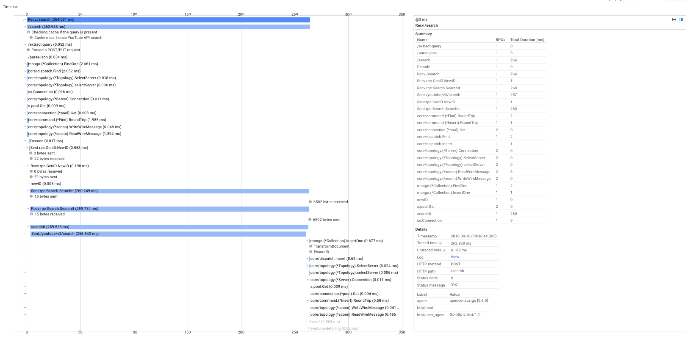

## media-search

media-search is a service for searching for media such as on YouTube by queries, accessible both on the commandline
and on a web user interface, via HTTP requests. It is instrumented with OpenCensus which gives us distributed tracing and
monitoring for visibility into our entire system as a call propagates through the various microservices.


### Structure

It consists of:

* A frontend service (OFE) which is accessible by HTTP requests
* Clients in Python3, Go, Javascript+HTML(accessible via webpage)
* A database to store information about already seen queries(caching)
* A backend for searching for content on YouTube's servers
* A backend for getting Ids
* A backend for asynchronous detail retrieval of searched queries so that later media inspections quickly
pull up information on searched media
* An instrumented Mongo Go driver from https://github.com/orijtech/mongo-go-driver

### How it works

Normal access is by hitting the frontend service (OFE) via HTTP requests to /search with either GET or POST methods.
OFE then invokes a gRPC transport based connection to the search backend(SB) which then searches for content from YouTube.
Because content search from YouTube incurs API quota costs as well as time expense having to fetch from YouTube's servers,
it helps to cache results so that subsequent repetitions will return cached content in very little time.
Once results have been returned during a cache-miss, they are cached to MongoDB and a subsequent asynchronous call is made
to a gRPC accessible service that then fetches individual meta information about each video and also caches that to MongoDB.

The architectural diagram looks something like this:


After tracing through requests, the service map might look like this:


### Requirements

Name|Installation resource|Notes
---|---|---
Go1.9+|https://golang.org/doc/install
Prometheus|https://prometheus.io/docs/introduction/first\_steps|
AWS Credentials|https://docs.aws.amazon.com/sdk-for-go/v1/developer-guide/configuring-sdk.html|
Google Cloud Platform credentials file|https://cloud.google.com/docs/authentication/getting-started|
MongoDB instance or credentials|https://docs.mongodb.com/getting-started/shell/installation/|You can easily install a local MongoDB instance if you do not have access to a cloud hosted one by installing `mongod`
Stackdriver Trace|https://console.cloud.google.com/apis/library/cloudtrace.googleapis.com/?q=stackdriver|Enable the API for your GCP project by also visiting https://console.cloud.google.com/apis/library and searching for the API "Stackdriver"
Stackdriver Monitoring|https://console.cloud.google.com/apis/library/monitoring.googleapis.com/?q=stackdriver|Enable the API for your GCP project by also visiting https://console.cloud.google.com/apis/library and searching for the API "Stackdriver"
AWS X-Ray|https://docs.aws.amazon.com/xray/latest/devguide/xray-services-lambda.html|

### Installing the source code
```shell
go get -u -v github.com/orijtech/media-search/...
```

### Running the project

Assuming you already set the credentials in [Requirements](#Requirements), run
```shell
make run-microservices
```

Also don't forget to run Prometheus like this
```shell
prometheus --config.file=prometheus.yml
```

If you'd like to terminate all the running binaries/microservices, and have `pkill` in your shell, you can run:
```shell
make kill-microservices
```

### Clients

Client|Language|Running it
---|---|---
Web UI|Javascript+HTML|Visit http://localhost:9778
clients/client.go|Go|`go run clients/client.go`
clients/client.py|Python3|`python3 clients/client.py`
clients/client.sh|Shell|`./clients/client.sh`


The WebUI looks something like this


### Inspecting traces and metrics
You can examine traces and metrics by visiting
* AWS X-Ray
* Stackdriver

### Screenshots
The clients' HTTP requests propagate their
traces through to the server and back, and then to the exporters yielding
insights such as:

#### HTTP requests


#### DB operations



